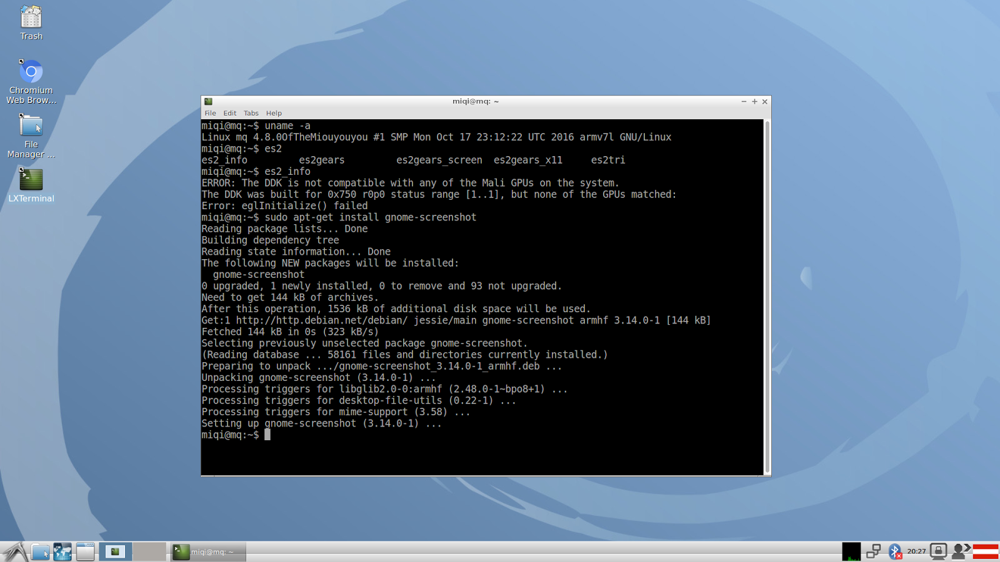

You're welcome to fork this repository and host your own configuration file.
**Change the value MYGITTREE in the following script if you forked this repository.**
Remember to remove the CROSS_COMPILE line if you're compiling from the same ARM system you intend to boot from.

Here's how to prepare and compile a recent official kernel, with Mali Kernel space drivers (but no UMP support as it fails to compile), for a RK3288 MiQi device:

```bash
export MYGITTREE=Miouyouyou/MyyQi-kernel
# Getting the kernel
git clone --depth 1 --branch v4.8 'git://git.kernel.org/pub/scm/linux/kernel/git/torvalds/linux.git'
cd linux
# Download, prepare and copy the Mali Kernel-Space drivers. 
# Some TGZ are AWFULLY packaged...
wget 'http://malideveloper.arm.com/downloads/drivers/TX011/r14p0-01rel0/TX011-SW-99002-r14p0-01rel0.tgz'
tar zxvf TX011-SW-99002-r14p0-01rel0.tgz
cd TX011-SW-99002-r14p0-01rel0
find . -type 'f' -exec chmod 0644 {} ';'
find . -type 'd' -exec chmod 0755 {} ';'
find . -name 'sconscript' -exec rm {} ';'
rm -r 'driver/product/kernel/patches' 'driver/product/kernel/license.txt'
cp -r driver/product/kernel/* ../
cd ..
rm -r TX011-SW-99002-r14p0-01rel0 TX011-SW-99002-r14p0-01rel0.tgz
# Download and apply the patch that enable the selection and 
# compilation of the Mali Kernel-Space drivers,
wget "https://raw.githubusercontent.com/$MYGITTREE/master/patches/0001-Post-Mali-additions.patch"
git apply 0001-Post-Mali-additions.patch
# Compile the kernel, using a personal configuration file.
# If you compile from an ARM system, remove the CROSS_COMPILE line
export CROSS_COMPILE=armv7a-hardfloat-linux-gnueabi-
export ARCH=arm
make mrproper
wget -O .config "https://raw.githubusercontent.com/$MYGITTREE/master/config/MyyMaliIsRicher"
make rk3288-miqi.dtb zImage modules -j5
# Kernel compiled
# 
#  The remaining commands were only used to generate this git tree and
# can be ignored.
mkdir /tmp/MyyQi
mkdir /tmp/MyyQi/boot
make INSTALL_MOD_PATH=/tmp/MyyQi modules_install
make INSTALL_PATH=/tmp/MyyQi/boot install
cp arch/arm/boot/zImage /tmp/MyyQi/boot/zImage
cp arch/arm/boot/dts/rk3288-miqi.dtb /tmp/MyyQi/boot/
# Your kernel and modules files are now in /tmp/MyyQi
```
The user [peba](http://www.bitkistl.com/), on the [mqmaker's forums](https://forum.mqmaker.com/t/mainline-kernel-compilation/572/9), were able to boot kernels built that way successfully on a [MiQi board](https://mqmaker.com/doc/introduction-to-miqi/) using a Debian 9 distribution.



TODO
----

- [ ] Document how to use the generated kernel and boot it
- [*] Add the [Open Source Kernel-space Mali Midgard drivers](http://malideveloper.arm.com/resources/drivers/open-source-mali-midgard-gpu-kernel-drivers/)
- [ ] Add [gator](https://github.com/ARM-software/gator)
- [ ] Document how to use [DS-5 : Streamline](https://developer.arm.com/products/software-development-tools/ds-5-development-studio/streamline/overview) to analyse OpenGL ES 2.x/3.x programs running on MiQi boards using such kernels.
